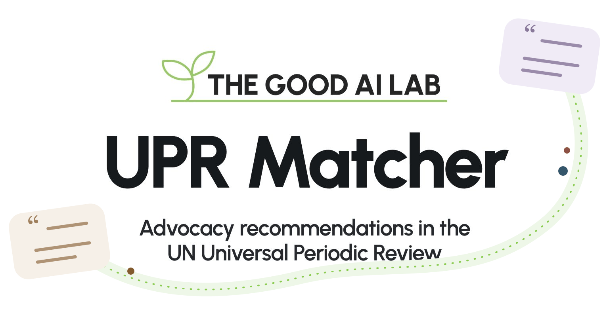
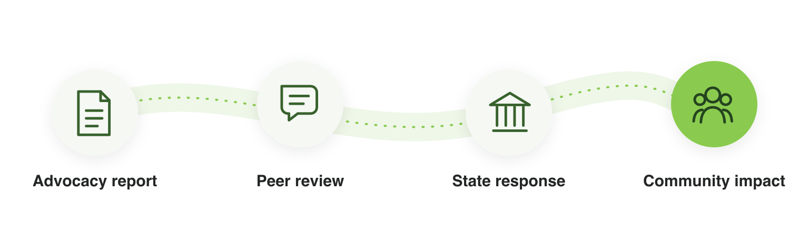
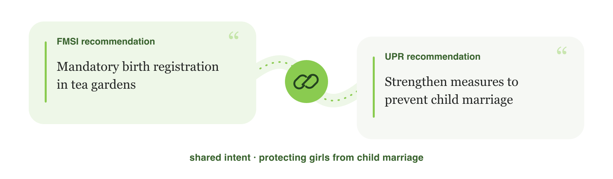
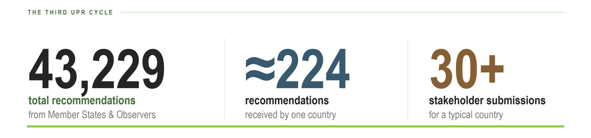
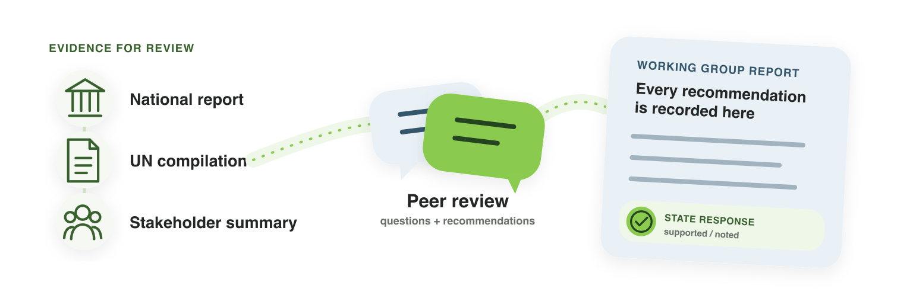
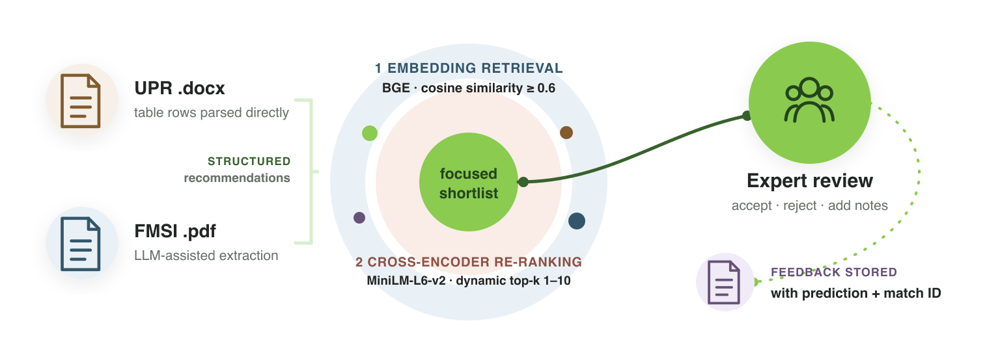
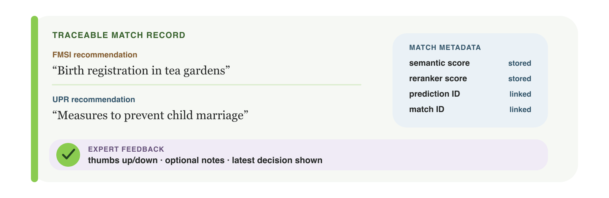
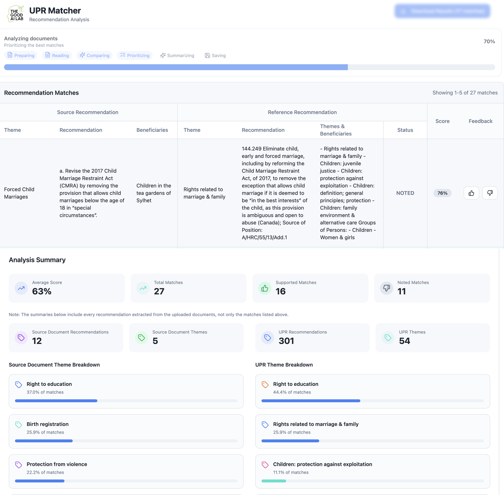

<!-- Hero -->
<p align="center">
  <picture>
    <source media="(prefers-color-scheme: dark)" srcset=".github/assets/cover-dark.png">
    <source media="(prefers-color-scheme: light)" srcset=".github/assets/cover.png">
    
  </picture>
</p>

<h1 align="center">UPR Matcher</h1>

<p align="center">
  <strong>Surfacing the connections between civil-society advocacy and the UN Universal Periodic Review.</strong>
</p>

<p align="center">
  An open-source tool by <a href="https://thegoodailab.org">The Good AI Lab</a> &amp; <a href="https://fmsi.ngo/en/">FMSI</a> that reads two sets of human-rights recommendations,
  <br>finds meaning rather than matching words, and hands experts a focused shortlist to review.
</p>

<p align="center">
  <a href="https://github.com/The-Good-AI-Lab/upr-matcher/blob/main/LICENSE"></a>
  
  
  
  
  
</p>

<p align="center">
  <a href="#-quick-start"><b>Quick start</b></a> ·
  <a href="#-how-it-works"><b>How it works</b></a> ·
  <a href="#-under-the-hood"><b>Under the hood</b></a> ·
  <a href="#-architecture"><b>Architecture</b></a> ·
  <a href="https://thegoodailab.org/blog/upr-matcher"><b>Read the story ↗</b></a>
</p>

---

## Why this exists

A single recommendation written by an NGO can travel much further than expected — echoing across governments, international reviews, and eventually formal commitments that states are expected to act on. But tracing that journey means reading through thousands of recommendations in hundreds of long reports.

<p align="center">
  <picture>
    <source media="(prefers-color-scheme: dark)" srcset=".github/assets/journey-dark.png">
    
  </picture>
</p>

The hard part isn't volume alone — it's **semantics**. Recommendations from different institutions use different language, target different stages of the policy process, and overlap only partially. Two reviewers reading the same set can reach different conclusions, and the results are nearly impossible to reproduce.

<p align="center">
  <picture>
    <source media="(prefers-color-scheme: dark)" srcset=".github/assets/matching-example-dark.png">
    
  </picture>
</p>

And it happens at scale. In the last completed UPR cycle alone, Member States and Observers made tens of thousands of recommendations — with dozens of stakeholder submissions per country to reconcile.

<p align="center">
  <picture>
    <source media="(prefers-color-scheme: dark)" srcset=".github/assets/scale-dark.png">
    
  </picture>
</p>

---

## 🌍 How the UPR works

The [Universal Periodic Review](https://www.ohchr.org/en/hr-bodies/upr/upr-home) is a UN process that examines the human-rights record of all 193 member states. Each review is informed by three public documents: a national report from the state under review, a compilation of relevant UN information prepared by OHCHR, and an OHCHR summary of stakeholder submissions. During the peer review, other states ask questions and make recommendations — every one is recorded in the Working Group report, and the reviewed state then marks each as **supported** or **noted**.

<p align="center">
  <picture>
    <source media="(prefers-color-scheme: dark)" srcset=".github/assets/upr-process-dark.png">
    
  </picture>
</p>

Organizations like FMSI contribute to this process — but seeing how their recommendations connect to the ones that surface in the review is exactly the needle-in-a-haystack problem UPR Matcher was built to solve.

---

## ✨ How it works

UPR Matcher reads the two sets of recommendations, looks for **meaning rather than identical wording**, and presents a focused set of likely connections for expert review. It narrows the search — people keep the interpretation.

The system is designed to **augment expert judgment, not replace it**. It handles the heavy lifting — scanning large volumes of text and surfacing patterns — so people can focus on the high-confidence matches that matter.

---

## 🔬 Under the hood

Two stages: a broad semantic retrieval pass surfaces every plausible pair, then a cross-encoder takes a closer look at the strongest candidates. Nothing is hidden — every suggestion carries the reason it was brought together, and every expert decision is stored.

<p align="center">
  <picture>
    <source media="(prefers-color-scheme: dark)" srcset=".github/assets/system-detail-dark.png">
    
  </picture>
</p>

| Stage | What happens | How |
| --- | --- | --- |
| **Extract** | UPR `.docx` tables parsed directly; FMSI `.pdf` recommendations pulled out with LLM assistance | `python-docx`, `pypdf`, `pydantic-ai` + `meta-llama/llama-3.3-70b` (OpenRouter) |
| **Retrieve** | Embed every recommendation, keep pairs above a cosine-similarity floor | `BAAI/bge-base-en-v1.5` via `fastembed`, threshold `≥ 0.6` |
| **Re-rank** | Score the shortlist with a cross-encoder, keep a dynamic top-k per source | `cross-encoder/ms-marco-MiniLM-L6-v2`, top-k `1–10` |
| **Review** | Experts accept / reject / annotate; feedback is stored against each match | FastAPI + SQLite / PostgreSQL |

Every match keeps a **traceable record** — the original texts, both scores, prediction and match IDs, and the latest expert decision — so teams can always see *why* two recommendations were linked.

<p align="center">
  <picture>
    <source media="(prefers-color-scheme: dark)" srcset=".github/assets/traceability-dark.png">
    
  </picture>
</p>

---

## 🖥️ The interface

Upload two documents, watch the pipeline run, and work through the ranked matches — each with its source and reference text, a status, a confidence score, and thumbs-up / thumbs-down feedback. An analysis summary breaks the run down by theme and match count.

<p align="center">
  
</p>

---

## 🚀 Quick start

**Full stack (recommended):**

```sh
docker compose up --build
```

| Service | URL |
| --- | --- |
| Frontend | `http://localhost:80` |
| Backend API | `http://localhost:8000` |

The worker runs alongside the backend in Docker Compose.

**Backend only (no Docker):**

```sh
cd backend && uv sync --all-extras && uv run app
```

In a separate terminal, start the worker:

```sh
cd backend && uv run worker
```

See [`backend/README.md`](backend/README.md) for environment variables, storage backends, and endpoints.

---

## 🧩 Architecture

The app is split into three services.

| Service | Path | Role |
| --- | --- | --- |
| **Backend** | `backend/` | FastAPI service for uploads, matching, and persistence APIs |
| **Worker** | `backend/` | Background process for long-running recommendation processing |
| **Frontend** | `frontend/` | React / TypeScript UI for uploads, progress, results, and feedback |

### API endpoints

| Method | Endpoint | Purpose |
| --- | --- | --- |
| `POST` | `/matches` | Accepts an FMSI PDF (`fmsi_pdf`) and a UPR DOC/DOCX (`un_doc`); extracts, embeds, matches, and stores every run |
| `POST` | `/feedback` | Records a thumbs-up/down (and optional notes) against a stored `prediction_id` + `match_id` |
| `GET` | `/health` | Readiness probe |

### Tech stack

| Layer | Tools |
| --- | --- |
| **Backend** | Python 3.12 · FastAPI · Uvicorn · Pydantic · `uv` |
| **NLP / ML** | `fastembed` (BGE) · `sentence-transformers` (cross-encoder) · `pydantic-ai` · OpenRouter |
| **Storage** | SQLite (local) · PostgreSQL (deployment) |
| **Frontend** | React 18 · TypeScript · Vite · Tailwind CSS · shadcn/ui · TanStack Query |
| **Ops** | Docker Compose · GitHub Container Registry · Helm / Kubernetes |

---

## 📦 Docker images

Backend (and later frontend) images are built in CI and pushed to **GitHub Container Registry** (`ghcr.io`). Tags follow branch / commit / release:

- **Branch** (e.g. `feature/foo`): `branch-name`, `branch-name-<7char-sha>`
- **main**: `main`, `main-<7char-sha>`, `latest`
- **Release tag** (e.g. `v1.0.0`): the tag as-is

Run the backend image locally:

```sh
docker run --rm -p 8000:8000 -e OPENROUTER_API_KEY=your-key ghcr.io/<owner>/<repo>/backend:latest
```

**Deployment** — the app is deployed via the [k8s-apps](https://github.com/The-Good-AI-Lab/k8s-apps) repo with Helm (`apps/upr-matcher/`). Use the image tags above in Helm values to pin to a branch, commit, or release.

---

## 🧹 Linting & formatting

The project uses [prek](https://prek.j178.dev/) for pre-commit hooks (shared `.pre-commit-config.yaml`).

```sh
# install (choose one)
curl --proto '=https' --tlsv1.2 -LsSf https://github.com/j178/prek/releases/download/v0.3.1/prek-installer.sh | sh
# or: uv tool install prek
# or: brew install prek
```

From the repo root: `prek install`, then `prek run` from anywhere in the repo (or `prek run --all-files`). CI runs the same checks via the Backend workflow (`.github/workflows/backend.yaml` → `common.yaml`).

---

## 🗂️ Repository layout

| Path | Description |
| --- | --- |
| `backend/` | FastAPI app, worker logic, scripts, prompts, tests |
| `frontend/` | React / TypeScript UI |
| `.github/workflows/` | CI for backend / frontend image builds |
| `docker-compose.yaml` | Local backend + worker + frontend stack |

---

## 🤝 Built by

A collaboration between the **[Good AI Lab](https://thegoodailab.org)** and **[Fondazione Marista per la Solidarietà Internazionale (FMSI)](https://fmsi.ngo/en/)**, exploring how hybrid AI systems can responsibly support human-rights advocacy.

> The most impactful AI systems are not those that replace human expertise, but those that strengthen it.

A full technical report is on its way — stay tuned.

## 📄 License

Distributed under the terms of the [GNU GPLv3](LICENSE).
